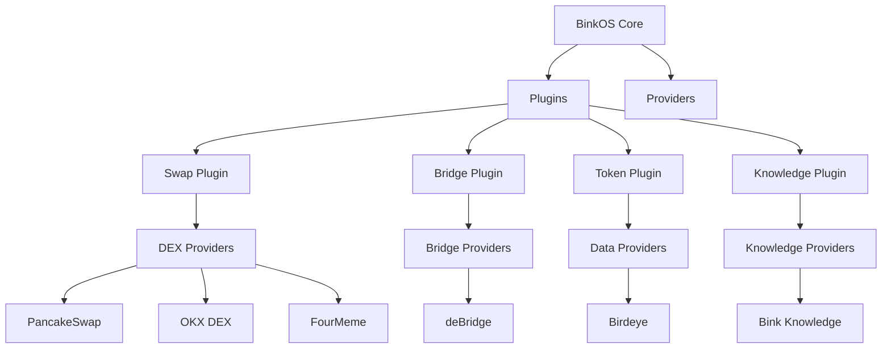
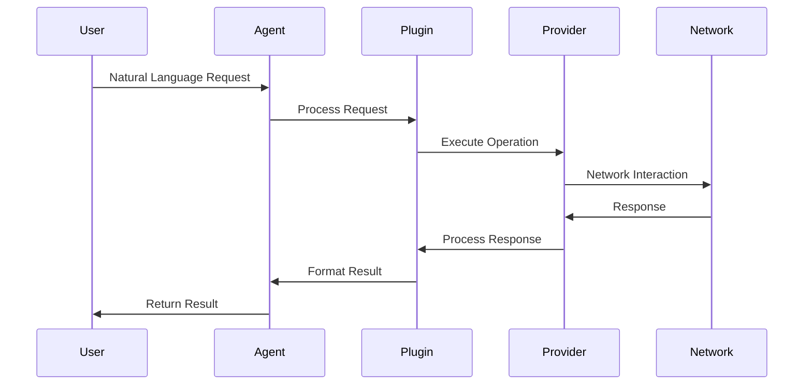

# Bink OS - Your AI-Powered DeFi Operating System

## Overview

Bink is a powerful DeFAI (Decentralized Finance + AI) OS built on BNB Chain that seamlessly combines the decentralized financial ecosystem with AI-driven analytics and automation. It provides a robust platform for building and deploying intelligent DeFi applications across multiple networks, with native support for BNB Chain's ecosystem.

## High-Level Overview

### System Architecture

### Workflow

## Why Choose Bink OS?

- 🌐 **Works Everywhere**: Built on BNB Chain with compatibility across major blockchains and L2s
- 🤖 **AI-Powered**: Smart trading and risk management
- 🔒 **Secure**: Built-in protection for your assets
- 🔌 **Expandable**: Easy to add new features and integrations

## Core Features

### 💱 Trading & Swaps

- Trade across different blockchains
- AI finds the best prices and routes
- Supports major DEXs:
  - PancakeSwap (BNB Chain)
  - Jupiter (Solana)
  - Uniswap (Ethereum)
  - 1inch (Multi-chain)
  - OKX DEX

### 🌉 Cross-Chain Bridge

- Move assets between networks
- Automatic best route finding
- Supports popular bridges:
  - Orbiter Finance
  - Other major bridges

### 👛 Wallet Management

- Secure key storage
- Multi-signature support
- Hardware wallet integration
- Real-time balance tracking

### 📊 Analytics & AI

- Price predictions
- Market trend analysis
- Risk assessment
- Portfolio optimization

## Smart Features

### 🤖 AI Capabilities

- **Market Intelligence**

  - Price predictions
  - Trend analysis
  - Risk detection
  - Market sentiment analysis

- **Automation**
  - Smart trading
  - Portfolio rebalancing
  - Gas optimization
  - Risk management

### 💬 Natural Language Interface

- Voice trading commands
- Conversational portfolio management
- Plain English market queries
- Easy-to-understand transaction details

## Security Measures

- Encrypted wallet management
- Multi-factor authentication
- Regular security audits
- Transaction monitoring
- Fraud detection

## Supported Networks

- BNB Chain
- Ethereum & L2s
- Solana
- Other major blockchains
- Cross-chain compatibility

## Getting Started

[Documentation Coming Soon]

## For Developers

- Modular architecture
- Plugin system
- API integrations
- Contribution guidelines available

## ⚠️ Important Note

Bink OS is in active development. Always verify transactions and use with caution.

## Need Help?

- Documentation: [Coming Soon]
- Contributions: Welcome! See contributing guidelines
- Updates: Follow our development progress
