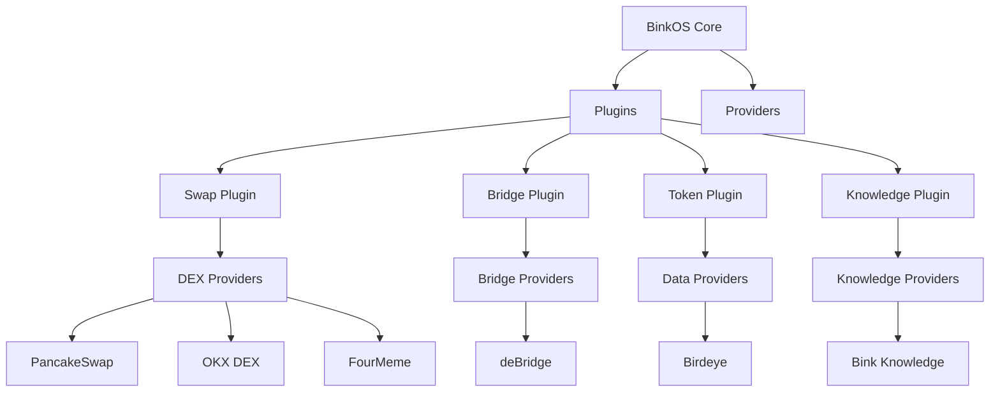
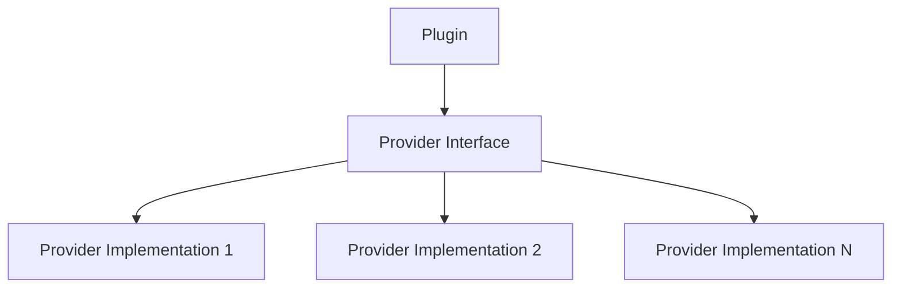
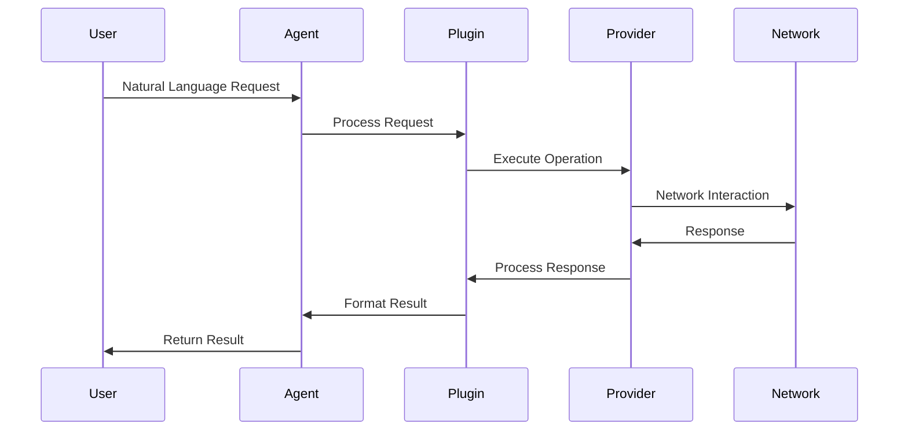

# BinkOS Architecture

## 1. Executive Summary

BinkOS is a powerful DeFAI (Decentralized Finance + AI) operating system that combines AI-driven analytics with cross-chain DeFi operations. It provides a comprehensive platform for intelligent trading, asset management, and cross-chain operations.

### Key Features

- 🌐 Cross-Chain Operations
- 🤖 AI-Powered Analytics
- 🔌 Plugin Architecture
- 🔒 Enterprise Security
- 💱 Multi-DEX Support
- 🌉 Cross-Chain Bridging

## 2. System Architecture

### 2.1 High-Level Overview



### 2.2 Core Components

#### 2.2.1 Core Layer (@binkai/core)

- Wallet Management
- Network Handling
- Agent System
- Plugin Architecture
- Settings Management

#### 2.2.2 Plugin System

1. **Swap Plugin** (@binkai/swap-plugin)

   - Multi-DEX support
   - Cross-chain compatibility
   - Price optimization
   - Slippage control

2. **Bridge Plugin** (@binkai/bridge-plugin)

   - Multi-chain bridging
   - Asset transfer optimization
   - Security validations
   - Bridge analytics

3. **Token Plugin** (@binkai/token-plugin)

   - Price discovery
   - Market data
   - Token metadata
   - Real-time updates

4. **Knowledge Plugin** (@binkai/knowledge-plugin)
   - Natural language queries
   - Documentation access
   - Technical information
   - Context-aware responses

#### 2.2.3 Provider Layer

1. **DEX Providers**

   - PancakeSwap Provider
   - OKX Provider
   - FourMeme Provider

2. **Bridge Providers**

   - deBridge Provider

3. **Data Providers**

   - Birdeye Provider

4. **Knowledge Providers**
   - Bink Provider

## 3. Technical Architecture

### 3.1 Core Architecture Patterns

#### 3.1.1 Plugin-Provider Pattern



#### 3.1.2 AI-Driven Pipeline


## 4. Implementation Details

### 4.1 Data Flow



### 4.2 Integration Patterns

#### Plugin Integration

```typescript
// Plugin registration
const plugin = new Plugin();
await plugin.initialize(config);
await agent.registerPlugin(plugin);
```

#### Provider Integration

```typescript
// Provider setup
const provider = new Provider(config);
await plugin.initialize({
  providers: [provider],
  // Additional configuration
});
```

### 4.3 Code Organization

```
binkos/
├── packages/
│   ├── core/               # Core functionality
│   ├── plugins/            # Plugin implementations
│   │   ├── swap/
│   │   ├── bridge/
│   │   ├── token/
│   │   └── knowledge/
│   └── providers/          # Provider implementations
│       ├── pancakeswap/
│       ├── okx/
│       ├── four-meme/
│       ├── debridge/
│       ├── birdeye/
│       └── bink/
├── examples/               # Usage examples
└── docs/                   # Documentation
```

## 5. Security & Performance

### 5.1 Security Architecture

- **Wallet Security**: Secure key management
- **Transaction Safety**: Multi-level validation
- **API Security**: Authentication and rate limiting
- **Data Protection**: Encrypted communication
- **Error Handling**: Comprehensive management

### 5.2 Performance Optimization

1. **Caching Strategy**

   - Provider response caching
   - Network state caching
   - Query result caching
   - Cache invalidation

2. **Network Optimization**

   - RPC load balancing
   - Fallback providers
   - Request batching
   - Connection pooling

3. **Resource Management**
   - Memory optimization
   - Connection pooling
   - Thread management
   - Resource cleanup

## 6. Future Vision

### 6.1 Current State

- Multi-chain DeFi operations
- AI-powered decision making
- Plugin-based extensibility
- Cross-chain asset management

### 6.2 Short-term Goals

1. **Enhanced AI Capabilities**

   - Advanced trading strategies
   - Predictive analytics
   - Risk assessment
   - Portfolio optimization

2. **Extended Protocol Support**
   - Additional DEX integrations
   - More bridge protocols
   - Layer 2 solutions
   - New blockchain networks

### 6.3 Long-term Vision

1. **Autonomous DeFi Operations**

   - Self-optimizing portfolios
   - Automated risk management
   - Smart rebalancing
   - AI-driven yield strategies

2. **Advanced Cross-chain Infrastructure**
   - Seamless asset transfers
   - Unified liquidity
   - Cross-chain composability
   - Protocol interoperability

## 7. Configuration & Dependencies

### 7.1 Environment Configuration

```bash
# API Keys
OPENAI_API_KEY=xxx
BIRDEYE_API_KEY=xxx
BINK_API_KEY=xxx

# Network Configuration
BINK_API_URL=xxx
```

### 7.2 Core Dependencies

- ethers: Ethereum interactions
- LangChain: AI capabilities
- TypeScript: Type safety
- pnpm: Package management

## 8. Best Practices

### 8.1 Development Guidelines

1. **Plugin Development**

   - Standard interface implementation
   - Lifecycle management
   - Provider interaction handling
   - Error management

2. **Provider Development**
   - Interface implementation
   - Network interaction handling
   - State and cache management
   - Error recovery

### 8.2 Security Best Practices

- Input validation
- Secure data handling
- Rate limiting
- Activity monitoring

### 8.3 Performance Best Practices

- Response caching
- Network optimization
- Resource management
- Error handling
