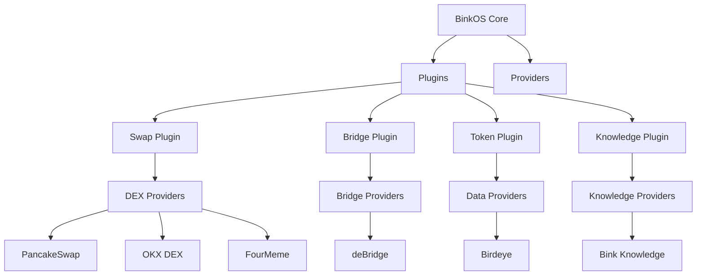
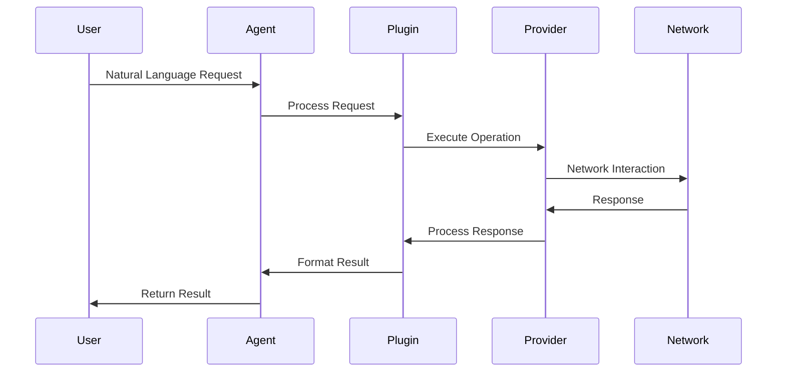

# @binkai/core

The core package of BinkOS - Your AI-Powered DeFi Operating System. This package provides the fundamental building blocks for a powerful DeFAI (Decentralized Finance + AI) platform built on BNB Chain, seamlessly combining decentralized financial ecosystem with AI-driven analytics and automation.

## Project Overview

BinkOS is designed to revolutionize DeFi interactions by providing:

- 🌐 **Cross-Chain Compatibility**: Native support for BNB Chain with seamless integration across major blockchains and L2s
- 🤖 **AI-Powered Intelligence**: Advanced trading strategies and risk management powered by LangChain
- 🔒 **Enterprise-Grade Security**: Robust wallet management and asset protection
- 🔌 **Modular Architecture**: Extensible plugin system for easy feature additions

This core package implements essential functionalities including:

- **Smart Trading System**: AI-driven price discovery and route optimization
- **Multi-Chain Support**: Integration with major DEXs like PancakeSwap, Jupiter, and Uniswap
- **Intelligent Bridging**: Cross-chain asset transfers with automatic route optimization
- **Advanced Analytics**: AI-powered market analysis and risk assessment

## High-Level Overview

### System Architecture



### Workflow



## Features

- **Wallet Management**: Cryptocurrency wallet operations and management
- **Agent System**: Intelligent agent functionality using LangChain
- **Storage**: Data storage and management utilities
- **Network**: Network communication and interaction capabilities
- **Plugin System**: Extensible plugin architecture
- **Settings Management**: System configuration and settings handling

## Usage

Here's a comprehensive example of how to use the core package with plugins for DeFi operations:

```typescript
import { Agent, Wallet, Network, settings, NetworkType, NetworksConfig } from '@binkai/core';

// 1. Configure Networks
const networks: NetworksConfig['networks'] = {
  bnb: {
    type: 'evm',
    config: {
      chainId: 56,
      rpcUrl: 'https://bsc-dataseed1.binance.org',
      name: 'BNB Chain',
      nativeCurrency: {
        name: 'BNB',
        symbol: 'BNB',
        decimals: 18,
      },
    },
  },
  ethereum: {
    type: 'evm',
    config: {
      chainId: 1,
      rpcUrl: 'https://eth.llamarpc.com',
      name: 'Ethereum',
      nativeCurrency: {
        name: 'Ether',
        symbol: 'ETH',
        decimals: 18,
      },
    },
  },
};

// 2. Initialize Core Components
const network = new Network({ networks });

// 3. Create Wallet
const wallet = new Wallet(
  {
    seedPhrase: 'your mnemonic here',
    index: 0,
  },
  network,
);

// 4. Initialize AI Agent
const agent = new Agent(
  {
    model: 'gpt-4',
    temperature: 0,
    systemPrompt: 'You are a BINK AI agent...',
  },
  wallet,
  networks,
);

// 5. Register Plugins (example with swap plugin)
const swapPlugin = new SwapPlugin();
await swapPlugin.initialize({
  defaultSlippage: 0.5,
  defaultChain: 'bnb',
  providers: [
    /* your swap providers */
  ],
  supportedChains: ['bnb', 'ethereum'],
});
await agent.registerPlugin(swapPlugin);

// 6. Execute Operations
// Example: Perform a swap
const swapResult = await agent.execute({
  input: 'Buy BINK from exactly 0.0001 BNB with 0.5% slippage on bnb chain',
});
```

### Environment Setup

Required environment variables:

```bash
OPENAI_API_KEY=your_openai_api_key
WALLET_MNEMONIC=your_wallet_mnemonic
```

For a complete working example with all plugins and providers configured, see [examples/basic/src/example.ts](../../examples/basic/src/example.ts).

### Plugin Integration

The core package supports various plugins:

- Swap Plugin (`@binkai/swap-plugin`)
- Token Plugin (`@binkai/token-plugin`)
- Custom plugins through the plugin system

Each plugin can be initialized with specific configurations and providers:

```typescript
// Example: Token Plugin Setup
const tokenPlugin = new TokenPlugin();
await tokenPlugin.initialize({
  defaultChain: 'bnb',
  providers: [
    /* your token providers */
  ],
  supportedChains: ['solana', 'bnb'],
});
await agent.registerPlugin(tokenPlugin);
```

## Installation

```bash
# Install as a dependency in your project
pnpm add @binkai/core
```

## Development Setup

This package uses pnpm for dependency management and is typically part of a monorepo setup.

### Prerequisites

```bash
# Install pnpm if you haven't already
npm install -g pnpm

# Install dependencies
pnpm install
```

### Development Commands

```bash
# Build the package
pnpm build

# Watch mode for development
pnpm dev

# Run tests
pnpm test

# Run tests in watch mode
pnpm test:watch
```

### Working in a Monorepo

If you're developing this package as part of the BinkOS monorepo:

```bash
# Build all dependencies
pnpm build --filter @binkai/core^...

# Build only this package
pnpm build --filter @binkai/core

# Run tests for this package and its dependencies
pnpm test --filter @binkai/core...
```

## Key Components

### Wallet

Handles cryptocurrency wallet operations, supporting multiple chains including Solana and Ethereum.

### Agent

Provides AI agent capabilities using LangChain integration for intelligent task processing.

### Storage

Manages data persistence and storage operations within the BinkOS ecosystem.

### Plugin System

Enables extensibility through a flexible plugin architecture.

### Settings

Handles system configuration and user preferences.

### Network

Manages network communications and blockchain interactions.

## Contributing

1. Fork the repository
2. Create your feature branch (`git checkout -b feature/amazing-feature`)
3. Commit your changes (`git commit -m 'feat: add some amazing feature'`)
4. Push to the branch (`git push origin feature/amazing-feature`)
5. Open a Pull Request

## License

This package is part of the BinkOS project. All rights reserved.
