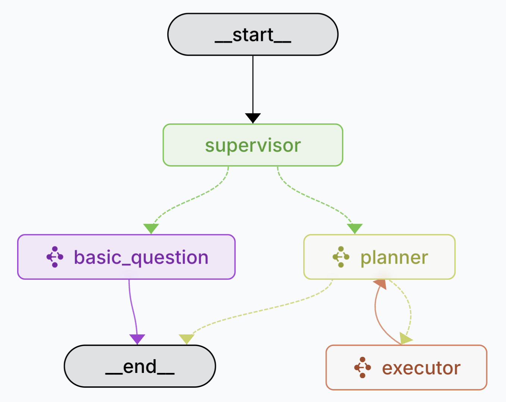
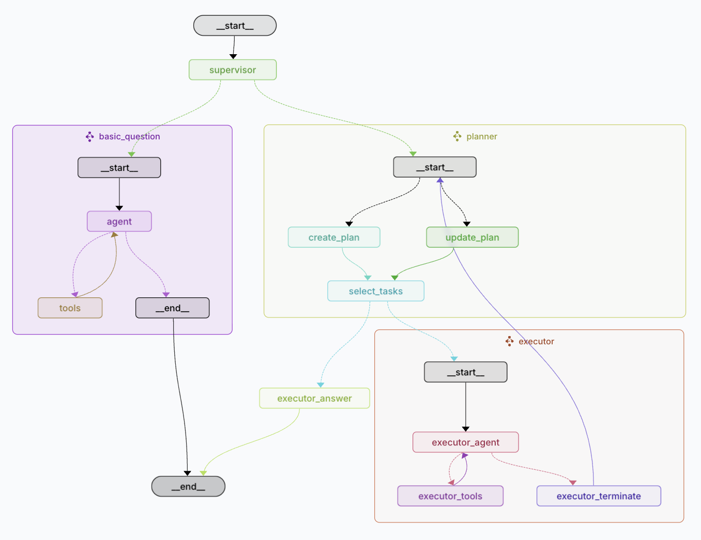

# BinkOS Planning Agent

## What is the Planning Agent?

The Planning Agent is an AI assistant that helps you complete complex blockchain tasks like transferring tokens, swapping cryptocurrencies, or moving assets between different blockchains. Think of it as a smart assistant that can break down complicated requests into smaller steps, handle each step carefully, and keep you informed throughout the process.

## How Does It Work? (The Simple Version)

When you ask the Planning Agent to do something (like "Transfer 0.1 ETH to my friend's wallet"), it:

1. **Understands your request** - Figures out exactly what you want to accomplish
2. **Creates a plan** - Breaks your request into clear, manageable steps
3. **Executes each step** - Completes each task in the correct order
4. **Adapts if needed** - Can change the plan if it encounters problems
5. **Reports back to you** - Explains what happened in simple terms

## Why Is This Better Than Regular AI Assistants?

Regular AI assistants are like having a helpful friend who can do one thing at a time. The Planning Agent is more like having a professional project manager who can:

- **Handle complex tasks** - Can manage multi-step processes that regular assistants might get confused by
- **Recover from errors** - If one step fails, it can try again or find another approach
- **Work across multiple blockchains** - Understands how to work with different cryptocurrency networks
- **Keep track of everything** - Remembers where it is in a complex process and what happened previously
- **Adapt on the fly** - Changes its approach based on what happens during execution

## Real-World Examples

Here's what the Planning Agent can help you with:

- **"Swap 100 USDC to ETH and then bridge it to Polygon"** - The agent handles token approval, finds the best swap rate, executes the swap, and then completes the bridge transaction.

- **"Stake 5 SOL in the highest-yielding protocol"** - The agent researches current yields, compares options, and executes the staking transaction with the best protocol.

- **"Check my portfolio value across all my wallets"** - The agent retrieves balances from multiple blockchains and provides a comprehensive overview.

## When to Use the Planning Agent

The Planning Agent shines when you need to:

- Complete tasks that require multiple transactions
- Work with different tokens across multiple blockchains
- Execute complex financial operations
- Recover gracefully if something goes wrong during a process
- Get detailed information about what's happening with your request

For simple requests like checking a single balance or sending a basic transaction, a standard blockchain assistant might be faster.

## Benefits for Users

- **Peace of mind** - The agent carefully plans and executes transactions to avoid costly mistakes
- **Transparency** - Always knows what's happening with your request and keeps you informed
- **Adaptability** - Can handle unexpected situations that might arise during transactions
- **Simplicity** - Handles complex blockchain operations without requiring you to understand all the technical details
- **Efficiency** - Completes multi-step processes without needing constant instructions

## How the Planning Agent Works with the BinkOS Ecosystem

The Planning Agent is part of the BinkOS ecosystem, which means it has access to:

- Your connected wallet(s) (only with your permission)
- Multiple blockchain networks
- Various plugins that extend its capabilities
- Secure storage for remembering your preferences

All of this works together to provide a powerful but easy-to-use interface for managing your digital assets across the blockchain landscape.

## How the Planning Agent Works: The Workflow Explained

### The Simple View

Think of the Planning Agent as a smart helper with different departments that work together. Here's the simple picture:

1. **Supervisor**: This is like the receptionist who looks at your request and decides which department should handle it.

2. The receptionist then sends your request down one of these paths:

   - **Basic Question Path**: For simple questions like "What's my balance?" - gets you a quick answer
   - **Planner Path**: For complex requests like "Transfer tokens between blockchains" - needs careful planning
   - **Executor Path**: For actually carrying out the plans that were made

3. No matter which path your request takes, you'll always get a clear answer at the end.

This smart system means you get fast answers for simple questions and careful handling for complex tasks.

### The Decision-Making Supervisor

The Supervisor is like a smart traffic controller for your requests. It asks:

- Can this be answered with a simple lookup? (Basic Question)
- Or does this need a step-by-step plan to complete? (Planning)

Here's what the Supervisor looks for:

- **Simple Questions** (Basic Question Path):

  - Checking balances: "What's my ETH balance?"
  - Transaction history: "Show me my recent transactions"
  - Price checks: "What's the current price of Bitcoin?"
  - Account info: "Which wallets do I have connected?"
  - Learning: "How does staking work?"

- **Complex Requests** (Planning Path):
  - Any money movement: "Transfer 0.5 ETH to this address"
  - Multi-step tasks: "Swap USDC to ETH and bridge to Polygon"
  - Actions needing permission: "Stake my ETH in Lido"
  - Cross-chain operations: "Move my assets from Ethereum to Solana"
  - Portfolio management: "Rebalance my portfolio to 60% ETH and 40% BTC"

This smart sorting system gives you:

- Quick answers when speed matters
- Careful planning when accuracy is crucial
- The right level of attention for every request

### The Expanded View

Behind the scenes, there's a bit more happening. Imagine a company with specialized departments:

1. **Supervisor**: The main desk that receives all requests and directs traffic.

2. If your request is a **Basic Question**:

   - It goes to the "agent" department that can quickly look up information
   - This team has access to various "tools" to find what you need
   - You get a direct answer without any complicated processes
   - The path ends with a clear response

3. If your request needs **Planning**:

   - **Create Plan**: Like a project manager breaking down your big request into smaller tasks
   - **Update Plan**: Adjusts the plan as each step completes (like when a map reroutes if there's traffic)
   - **Select Tasks**: Chooses which task to do next in the right order
   - **Planning Answer**: Prepares a clear explanation of what happened

4. For actually doing the tasks, there's the **Executor**:
   - **Executor Agent**: The team that carries out the planned tasks
   - **Executor Tools**: Special equipment for interacting with different blockchains
   - **Ask User**: Sometimes checks with you if they need more information
   - **Executor Terminate**: Can stop the process if needed (like if something goes wrong)

All these teams work together seamlessly - you just ask what you want, and the Planning Agent handles all this complexity behind the scenes. You only see the final result: your task completed successfully with a clear explanation of what happened.
